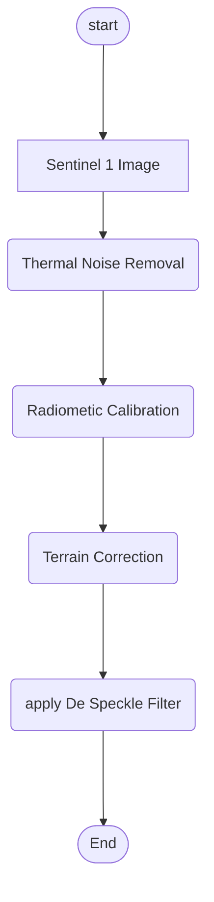

# Google Earth Engine SNAP Replication

## Notes
Replicate what google earth engine work flow is. GEE injest S1 sences and apply thermal noise reduction, Radiometric calibration and Terrain Correction using STRM 30 DEM

GEE data catalogue entry https://developers.google.com/earth-engine/datasets/catalog/COPERNICUS_S1_GRD#description

We aim to repeat what was done in GEE but with SNAP. 

For the purposes of simplify, the Graph processing tool will be used, in conjunction with the terminal

Subset and Co registration are to be indepently of each other

## Requirement
- SNAP Desktop >= 8.0
- Graph Processing Tool (gpt)
- a graph xml file that reperesnts the processing chain
- Python >= 3.7 (can be used as a replacement for shell scripting)

## Tools from Sentinel - 1 Toolbox
- Thermal Noise Removal
- Radiometric Calibration
- Terrain Correction
    - DEM: SRTM
- De Spekcle Filter
    - BOXCAR
    - Window 3 x 3
- Co Registration
    - ref image first image the in the virutal stack
    - all other images are to be registered to the red image
- Subset / Clip
    - clip to some defined AOI
    - AOI needs to be in WKT format  
  <br>
# Procesing Chains

## Single Image Processing Chain


## Iterators

### Co Registraion
```mermaid
grpah TD
    aa([start]) ---> A
    A[Image Pool] ---> B()                 
```


